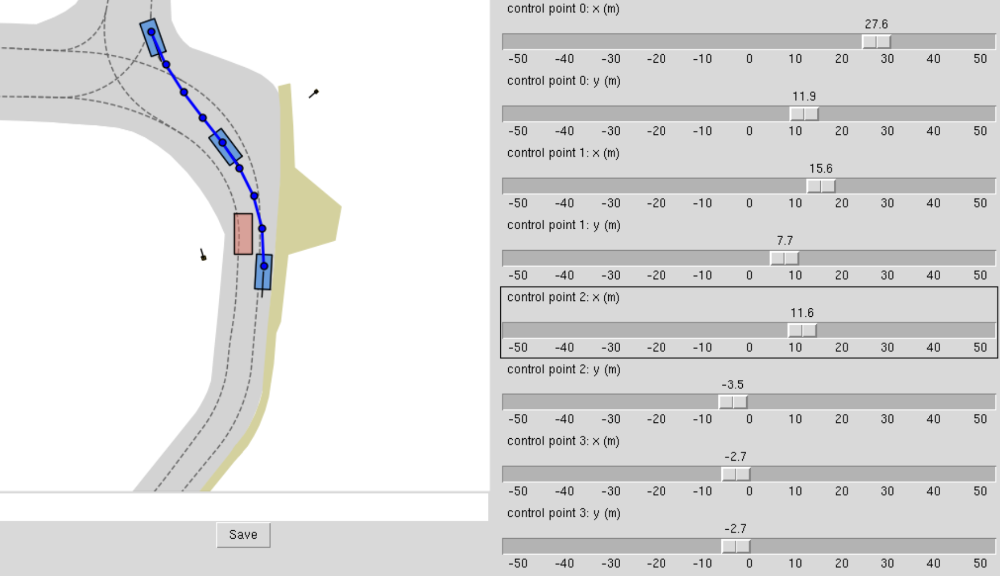

# RealEngine: Simulating Autonomous Driving in Realistic Context

### [[Project]]() [[Paper]]() 

> [**RealEngine: Simulating Autonomous Driving in Realistic Context**](),            
> [Junzhe Jiang](https://scholar.google.com/citations?user=gnDoDP4AAAAJ), [Nan Song](https://scholar.google.com/citations?user=wLZVtjEAAAAJ), [Jingyu Li](https://github.com/Whale-ice), [Xiatian Zhu](https://xiatian-zhu.github.io/), [Li Zhang](https://lzrobots.github.io) 

**Official implementation of "RealEngine: Simulating Autonomous Driving in Realistic Context".** 

## 🛠️ Pipeline
<div align="center">
  
</div><br/>

## ▶️ Get started
### 📦 Environment
1. Prepare the environment.
```
# Clone the repo.
git clone https://github.com/fudan-zvg/RealEngine.git
cd RealEngine

# Make a conda environment.
conda create --name realengine python=3.9
conda activate realengine

# Install PyTorch according to your CUDA version
# CUDA 11.7
pip install torch==2.0.1 torchvision==0.15.2 torchaudio==2.0.2

# Install nuplan devkits
git clone https://github.com/motional/nuplan-devkit.git && cd nuplan-devkit
pip install -e .

# Install raytracing
git clone https://github.com/ashawkey/raytracing
cd raytracing
pip install .
```
2. Install and download Navsim-mini as [Navsim install](https://github.com/autonomousvision/navsim/blob/main/docs/install.md), and download RealEngine scene checkpoints in [HuggingFace RealEngine](https://huggingface.co/datasets/selfspin/RealEngine/tree/main/dataset/realengine).
The folder tree is as follows:
```
dataset
├── openscene
│   ├── maps
│   └── openscene-v1.1
│       ├── navsim_logs
│       └── sensor_blobs
└── realengine
    ├── background
    │   ├── cam
    │   └── lidar
    ├── irrmaps
    ├── relighting
    └── vehicles
```
Then, build cache for navsim-mini
```
chmod +x scripts/evaluation/run_metric_caching.sh
./scripts/evaluation/run_metric_caching.sh
```

3. For the [DriveX](submodules/DriveX) and [GSLiDAR](submodules/GSLiDAR) submodules, please refer to their respective `README.md` files for installation instructions.

4. Download navsim AD agent checkpoints to `./model`.

| Agent          | Checkpoint                                                   |
| -------------- | ------------------------------------------------------------ |
| TransFuser     | [transfuser_seed_0.ckpt](https://huggingface.co/autonomousvision/navsim_baselines/tree/main/transfuser) |
| VAD            | [vad_epoch_99.ckpt](https://huggingface.co/datasets/selfspin/RealEngine/tree/main/model) |
| DiffusionDrive | [diffusiondrive_navsim_88p1_PDMS.pth](https://huggingface.co/hustvl/DiffusionDrive/tree/main) |


The folder tree is as follows:
```
model
├── diffusiondrive_navsim_88p1_PDMS.pth
├── kmeans_navsim_traj_20.npy
├── transfuser_seed_0.ckpt
└── vad_epoch_99.ckpt
```

5. Due to the complexity of the environment setup, we provide the [final pip list](docs/final_pip_list.md) of our environment to facilitate verification and reproducibility.
### 🚗 Evaluating
You can use the following command to simulating autonomous driving in realistic context.
```
# DiffusionDrive
# Non-reactive simulation.
CUDA_VISIBLE_DEVICES=0 python navsim/planning/script/run_pdm_score_with_render_base.py \
train_test_split=mini agent=diffusiondrive_agent worker=single_machine_thread_pool \
agent.checkpoint_path=model/diffusiondrive_navsim_88p1_PDMS.pth \
experiment_name=diffusiondrive_agent_eval

# Safety test simulation.
CUDA_VISIBLE_DEVICES=1 python navsim/planning/script/run_pdm_score_with_render_edit.py \
train_test_split=mini agent=diffusiondrive_agent worker=single_machine_thread_pool \
agent.checkpoint_path=model/diffusiondrive_navsim_88p1_PDMS.pth \
experiment_name=diffusiondrive_agent_eval

# Multi-agent interaction simulation.
CUDA_VISIBLE_DEVICES=1 python navsim/planning/script/run_pdm_score_with_render_multi_agent.py \
train_test_split=mini agent=diffusiondrive_agent worker=single_machine_thread_pool \
agent.checkpoint_path=model/diffusiondrive_navsim_88p1_PDMS.pth \
experiment_name=diffusiondrive_agent_eval
```

### 🏗️ Design your custom test cases 
You can use [scripts/gui.py](scripts/gui.py) to construct the testing scenarios you require.
```
python scripts/gui.py
```
We model the trajectories using Bézier curves, allowing you to freely configure the trajectories of the inserted vehicles by controlling four control points, as illustrated in the figure below.
<div align="center">
  
</div><br/>

## 📊 Benchmark
### Non-reactive simulation
| Method                  | Loop       | Ego stat. | Image | LiDAR | NC ↑ | DAC ↑ | TTC ↑ | Comf. ↑ | EP ↑ | PDMS ↑ |
|-------------------------|------------|-----------|-------|-------|------|--------|--------|----------|-------|---------|
| Constant velocity  |            | ✓         |       |       | 92.9 | 64.3   | 85.7   | 100      | 29.4  | 46.8    |
| **Open-loop**           |            |           |       |       |      |        |        |          |       |         |
| ST-P3               | Open-loop  | ✓         | ✓     |      | 92.9 | 71.4   | 92.9   | 100      | 46.2  | 59.6    |
| VAD                | Open-loop  | ✓         | ✓     |      | 92.9 | 85.7   | 92.9   | 100      | 48.5  | 66.1    |
| TransFuser          | Open-loop  | ✓         | ✓     | ✓     | 92.9 | 85.7   | 92.9   | 100      | 55.9  | 69.1    |
| DiffusionDrive    | Open-loop  | ✓         | ✓     | ✓     | 92.9 | 85.7   | 92.9   | 100      | 56.7  | **69.5** |
| **Closed-loop**         |            |           |       |       |      |        |        |          |       |         |
| ST-P3            | Closed-loop| ✓         | ✓     |    | 100  | 64.3   | 85.7   | 100      | 35.6  | 47.5    |
| VAD                | Closed-loop| ✓         | ✓     |     | 85.7 | 78.6   | 92.9   | 100      | 34.3  | 53.0    |
| TransFuser         | Closed-loop| ✓         | ✓     | ✓     | 92.9 | 71.4   | 85.7   | 100      | 46.0  | 57.9    |
| DiffusionDrive    | Closed-loop| ✓         | ✓     | ✓     | 92.9 | 71.4   | 92.9   | 100      | 47.1  | **61.3** |
| **Ground truth**         |            |           |       |       |      |        |        |          |       |         |
| *Human*                 |            |           |       |       | 100  | 100    | 92.9   | 100      | 68.3  | 83.8    |

### Safety test simulation
| Method                    | Ego stat. | Image | LiDAR | NC ↑ | DAC ↑ | TTC ↑ | Conf. ↑ | EP ↑ | PDMS ↑ |
|-----------------------|-----------|-------|-------|------|--------|--------|----------|-------|--------|
| Constant velocity             | ✓         |       |       | 47.6 | 71.4   | 38.1   | 100      | 36.7  | 36.3   |
| ST-P3                       | ✓         | ✓     |       | 47.6 | 100    | 42.9   | 100      | 44.7  | 44.4   |
| VAD                        | ✓         | ✓     |       | 47.6 | 95.2   | 28.6   | 100      | 41.2  | 37.0   |
| TransFuser                     | ✓         | ✓     | ✓     | 47.6 | 100    | 38.1   | 100      | 44.1  | 42.2   |
| DiffusionDrive                | ✓         | ✓     | ✓     | 57.1 | 100    | 52.4   | 100      | 54.0  | **53.8** |


### Multi-agent interaction simulation
| Method                    | Ego stat. | Image | LiDAR | NC ↑ | DAC ↑ | TTC ↑ | Conf. ↑ | EP ↑ | PDMS ↑ |
|-----------------------|-----------|-------|-------|------|--------|--------|----------|-------|--------|
| Constant velocity              | ✓         |       |       | 42.8 | 60.7   | 39.3   | 100      | 27.8  | 27.4   |
| ST-P3                        | ✓         | ✓     |       | 53.6 | 96.4   | 50.0   | 100      | 44.6  | 46.3   |
| VAD                          | ✓         | ✓     |       | 32.1 | 71.4   | 32.1   | 100      | 27.7  | 28.8   |
| TransFuser                   | ✓         | ✓     | ✓     | 60.7 | 96.4   | 53.6   | 100      | 54.3  | **55.0** |
| DiffusionDrive          | ✓         | ✓     | ✓     | 57.1 | 96.4   | 50.0   | 100      | 51.7  | 51.9   |