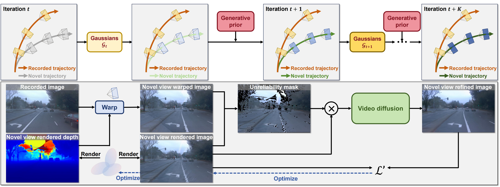

# Driving Scene Synthesis on Free-form Trajectories with Generative Prior
### [[Project]](https://fudan-zvg.github.io/DriveX) [[Paper]](https://arxiv.org/abs/2412.01717) 

> [**Driving Scene Synthesis on Free-form Trajectories with Generative Prior**](https://arxiv.org/abs/2412.01717),            
> Zeyu Yang*, Zijie Pan*, Yuankun Yang*, [Xiatian Zhu](https://surrey-uplab.github.io/), [Li Zhang](https://lzrobots.github.io)  
> **Arxiv preprint**

**Official implementation of "Driving Scene Synthesis on Free-form Trajectories with Generative Prior".** 

## 🛠️ Pipeline
<div align="center">
  
</div><br/>

## Installation
```bash
conda activate realengine

# Install requirements
pip install -r requirements.txt

# Install submodules
pip install ./submodules/diff-gaussian-rasterization
pip install ./submodules/chamfer/chamfer3D
pip install ./submodules/simple-knn

# Install requirements for viewcrafter
pip install -r requirements_viewcrafter.txt

# Install others
conda install conda-forge::colmap
pip install ninja pytorch3d
```


## 📜 BibTeX
```bibtex
@article{yang2024drivex,
  title={Driving Scene Synthesis on Free-form Trajectories with Generative Prior},
  author={Yang, Zeyu and Pan, Zijie and Yang, Yuankun and Zhu, Xiatian and Zhang, Li},
  journal={arXiv preprint 2412.01717},
  year={2024},
}
```


